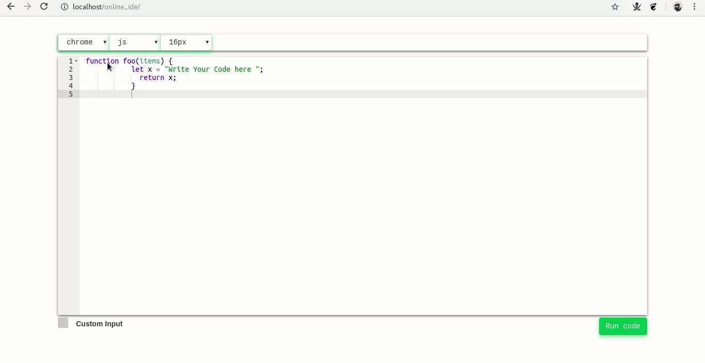

# CodeAdept 2.0

  Change Permissions of directory while running this code.
  and for login create a database name ide  and create table users
  table contains id(auto increment and primary key), username,password,email,phone,year,and branch    

  
