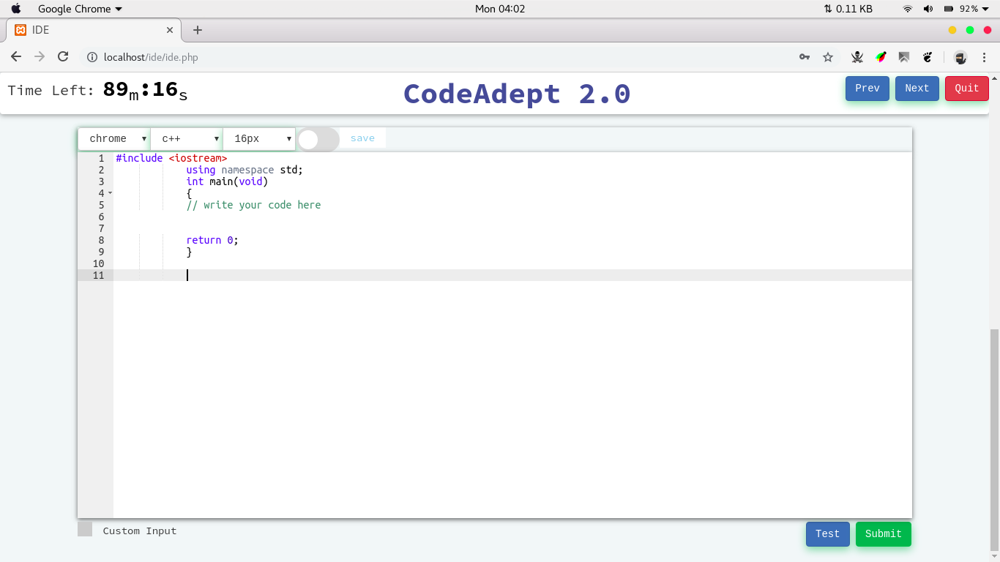

    

#   Codeadept 2.0

###  setup

import `ide.sql` and change username and password of root in files according to your environment and also change the permission of folder that will serve this code.

###  Login Screen

### Coding Area

### Run a program

